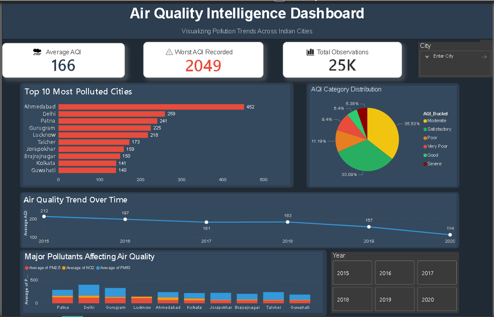

# 🌍 Air Quality Intelligence Dashboard
### Visualizing Pollution Trends Across Indian Cities

Air pollution has become one of the most critical environmental and public health challenges affecting urban populations today. Cities continuously generate large volumes of air quality data, including AQI levels and pollutant concentrations such as **PM2.5, PM10, and NO₂**. However, raw data alone makes it difficult to quickly understand pollution trends, identify hotspots, or determine the key pollutants affecting air quality.

This project transforms complex environmental data into **clear, interactive insights** through a **Power BI dashboard** that allows users to analyze pollution patterns across cities and time periods.

---

## 📊 Project Overview

The **Air Quality Intelligence Dashboard** analyzes historical air quality data across multiple Indian cities and presents meaningful insights through intuitive visualizations.

The dashboard enables users to:

- Identify the **most polluted cities**
- Understand the **distribution of AQI categories**
- Analyze **air quality trends over time**
- Compare **major pollutant concentrations**
- Interactively explore data using **filters and slicers**

The goal of this project is to transform raw environmental data into **actionable insights that improve understanding of urban air pollution**.

---

## 🚀 Dashboard Features

### 📌 KPI Indicators
Key performance indicators provide a quick summary of air quality data:

- **Average AQI**
- **Worst AQI Recorded**
- **Total Observations Analyzed**

---

### 📊 Top 10 Most Polluted Cities
A bar chart highlighting cities with the **highest pollution levels**, helping identify pollution hotspots quickly.

---

### 🧭 AQI Category Distribution
A pie chart showing the distribution of air quality levels:

- Good
- Satisfactory
- Moderate
- Poor
- Very Poor
- Severe

This helps understand the **overall air quality conditions across the dataset**.

---

### 📈 Air Quality Trend Over Time
A line chart visualizing **how pollution levels change over time**, helping identify whether air quality is improving or deteriorating.

---

### 🧪 Major Pollutants Affecting Air Quality
A stacked column chart comparing key pollutants:

- **PM2.5**
- **PM10**
- **NO₂**

This helps identify **which pollutants contribute most to poor air quality**.

---

### 🎛 Interactive Filters (Slicers)

The dashboard includes interactive controls allowing users to dynamically explore the data:

- **City Filter**
- **Year Selector**

These slicers allow users to analyze pollution trends **for specific cities and time periods**.

---

## 🛠 Tools & Technologies Used

- **Microsoft Power BI**
- **Power Query (Data Transformation)**
- **DAX (Data Analysis Expressions)**
- **CSV Dataset**

---

## 📂 Dataset

**Air Quality Data in India (2015–2020)**  
Source: Kaggle

https://www.kaggle.com/datasets/rohanrao/air-quality-data-in-india

---

## 📸 Dashboard Preview

---

## 🌱 Why This Project Matters

Air pollution affects **millions of people worldwide**, yet understanding pollution trends often requires analyzing complex datasets.

This dashboard simplifies environmental data analysis by providing **interactive visual insights**, enabling:

- Better **awareness of pollution patterns**
- Easier **exploration of air quality data**
- Data-driven discussions about **urban environmental conditions**

---

## 🔮 Future Improvements

Possible future enhancements include:

- Integration of **real-time air quality monitoring data**
- **Machine learning models** for AQI prediction
- Incorporating **weather, traffic, and industrial data**
- Expanding analysis to **multiple regions or countries**

---

## 📚 References

Rohan Rao. *Air Quality Data in India (2015–2020), Kaggle Dataset.*  
https://www.kaggle.com/datasets/rohanrao/air-quality-data-in-india  

Microsoft. *Power BI Documentation.*  
https://learn.microsoft.com/en-us/power-bi/

---

## 👨‍💻 Author

**Rishabh Gupta**  
VIT Vellore

---

⭐ If you found this project interesting, consider **starring the repository**!
